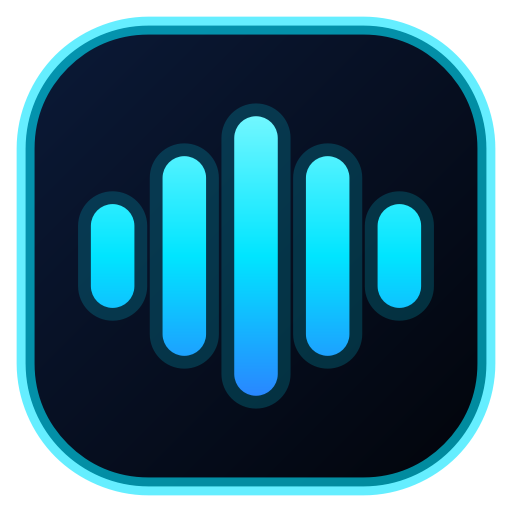
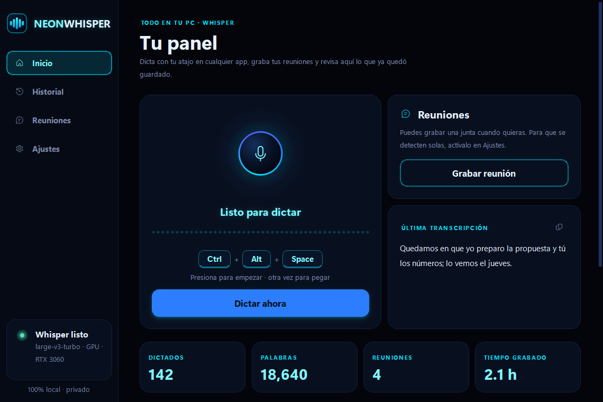
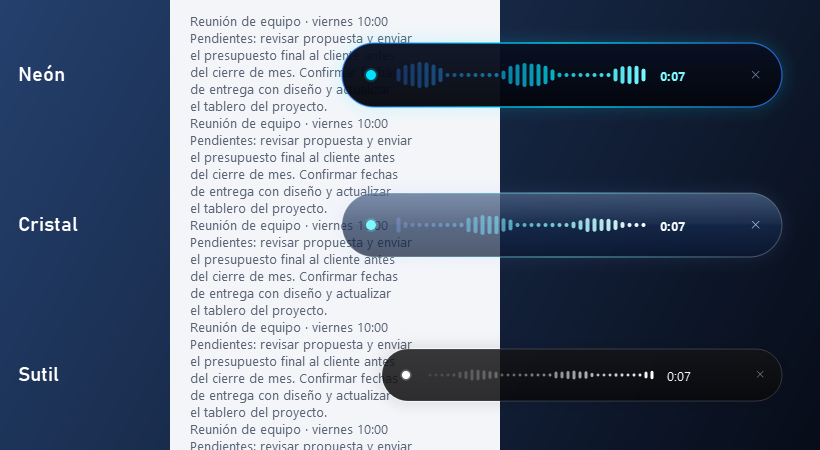
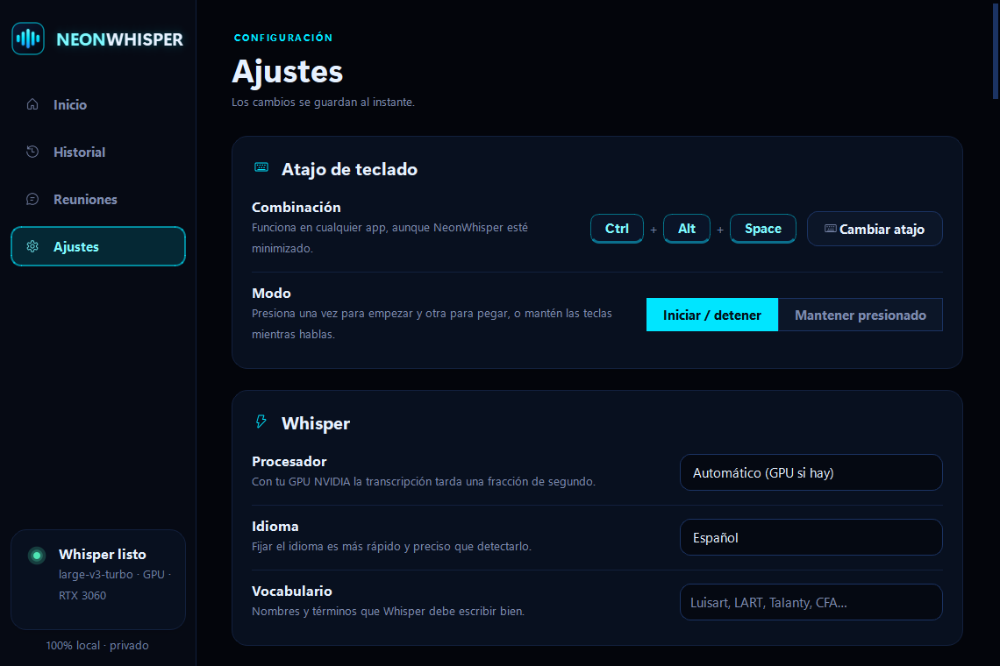
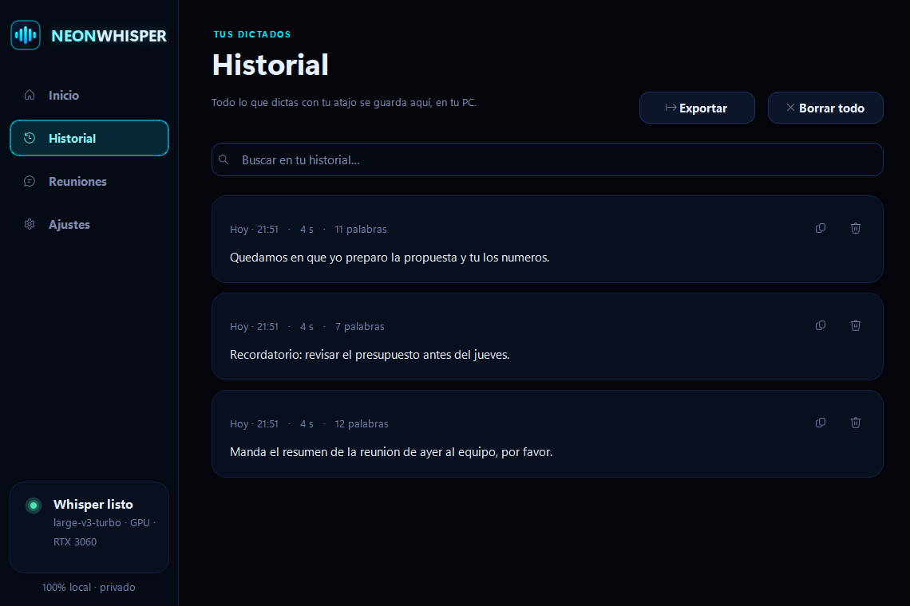

  

<h1 align="center">NeonWhisper</h1>

  <b>Dictado por voz 100% local con Whisper.</b> 
  Presiona tu atajo en cualquier app, habla y el texto se pega solo donde está tu cursor.

  

## Qué hace

- **Atajo global configurable** (por defecto `Ctrl + Alt + Space`): funciona en cualquier app, aunque NeonWhisper esté minimizado en la bandeja.
- **Dos modos**: *Iniciar / detener* (presionas una vez para hablar y otra para pegar) o *Mantener presionado* (walkie-talkie).
- **Pega automáticamente** donde está tu cursor y después restaura lo que tenías en el portapapeles.
- **Barra flotante neón** con las ondas de tu voz en tiempo real, cronómetro y botón para cancelar (`Esc` también cancela).
- **Barra flotante a tu gusto** (Ajustes → Barra flotante): 3 diseños (*Neón*, *Cristal* y *Sutil*, negro con tonos blancos), tamaño, transparencia del fondo y opacidad, con vista previa en pantalla.
- **Sonidos** al empezar y terminar de grabar, con volumen ajustable.
- **Historial** con búsqueda, copiar, borrar y exportar a `.txt`.
- **Whisper large-v3-turbo** con [faster-whisper](https://github.com/SYSTRAN/faster-whisper): en una GPU NVIDIA transcribe ~9 s de audio en ~0.4 s. Si no hay GPU, usa el CPU automáticamente.
- **Vocabulario personalizado** para que escriba bien nombres propios y términos técnicos.
- **Prueba de micrófono**: graba 4 segundos, mide el nivel y te reproduce lo que grabó.
- **Gestor de modelos**: descarga con barra de progreso, velocidad y tiempo restante; pausa, continúa (incluso después de cerrar la app) o cancela. Usa varias conexiones en paralelo y verifica cada archivo.
- **Privado**: tu voz nunca sale de tu computadora.

  
  

  

## Instalación (Windows 10/11)

1. Descarga el repositorio: botón verde **Code → Download ZIP** y descomprímelo donde quieras que viva la app, **de preferencia en un SSD** (p. ej. `C:\NeonWhisper`). En un disco duro mecánico el modelo tarda ~20 s en cargar al encender la PC; en un SSD, ~4 s.
2. Doble clic en **`Instalar.bat`**.

El instalador hace todo solo:

- instala [uv](https://github.com/astral-sh/uv) y Python 3.12 **dentro de la carpeta** (no toca tu sistema),
- instala Whisper, las librerías CUDA y la interfaz,
- descarga el modelo `large-v3-turbo` (~1.6 GB, solo la primera vez),
- crea accesos directos en el escritorio y el menú Inicio,
- activa el **inicio con Windows** (minimizado en la bandeja, con Whisper ya cargado cuando lo necesites) y abre la app.

Después, abre **NeonWhisper** desde el escritorio o búscalo en el menú Inicio. Si mueves la carpeta de lugar, ejecuta `scripts\crear_accesos.bat` para regenerar los accesos directos y el inicio con Windows. Puedes desactivar el inicio automático en Ajustes → Comportamiento.

> **Requisitos:** Windows 10/11 · ~5 GB libres · internet solo para instalar. Recomendado: GPU NVIDIA con drivers recientes (funciona sin GPU, pero más lento).

## Uso

| Acción | Cómo |
| --- | --- |
| Dictar | Pon el cursor donde quieras escribir → `Ctrl + Alt + Space` → habla → `Ctrl + Alt + Space` |
| Cancelar | `Esc` o la ✕ de la barra flotante |
| Cambiar atajo | Ajustes → Atajo de teclado → **Cambiar atajo** y presiona tu combinación |
| Ver historial | Pestaña **Historial** (buscar, copiar, borrar, exportar) |
| Salir | Clic derecho en el ícono de la bandeja → **Salir** |

Si dictas con la ventana de NeonWhisper enfocada (por ejemplo, haciendo clic en el micrófono), el texto se **copia** al portapapeles en lugar de pegarse.

  
  

## Modelos

| Modelo | Precisión | Velocidad | VRAM aprox. |
| --- | --- | --- | --- |
| **large-v3-turbo** (predeterminado) | Muy alta | Muy rápida | ~2 GB |
| large-v3 | Máxima | Varias veces más lento que turbo | ~4 GB |
| medium | Alta | Rápida | ~2 GB |
| small | Media | Rápida incluso en CPU | ~1 GB |

Se administran en **Ajustes → Modelos de Whisper** (Descargar, Pausar, Continuar, Usar, Eliminar) y se guardan en `models/`.

## Dónde se guardan tus datos

- Ajustes, historial (`history.db`) y log: `%APPDATA%\NeonWhisper`
- Modelos de Whisper: carpeta `models/` junto a la app

## Solución de problemas

- **El atajo no hace nada en una app concreta:** si esa app corre como administrador, Windows bloquea atajos globales de apps normales. Para dictar ahí, abre NeonWhisper también como administrador.
- **Dice «Whisper listo · CPU» teniendo GPU NVIDIA:** actualiza tus drivers de NVIDIA y reinicia la app. En Ajustes → Procesador puedes forzar «GPU NVIDIA (CUDA)» para ver el error exacto.
- **No se escucha/graba nada:** elige tu micrófono en Ajustes → Audio.
- **Registro de errores:** `%APPDATA%\NeonWhisper\neonwhisper.log`.

## Stack

Python 3.12 · [faster-whisper](https://github.com/SYSTRAN/faster-whisper) (CTranslate2 + CUDA 12) · PySide6 (Qt) · sounddevice · keyboard · SQLite

## Licencia

MIT
