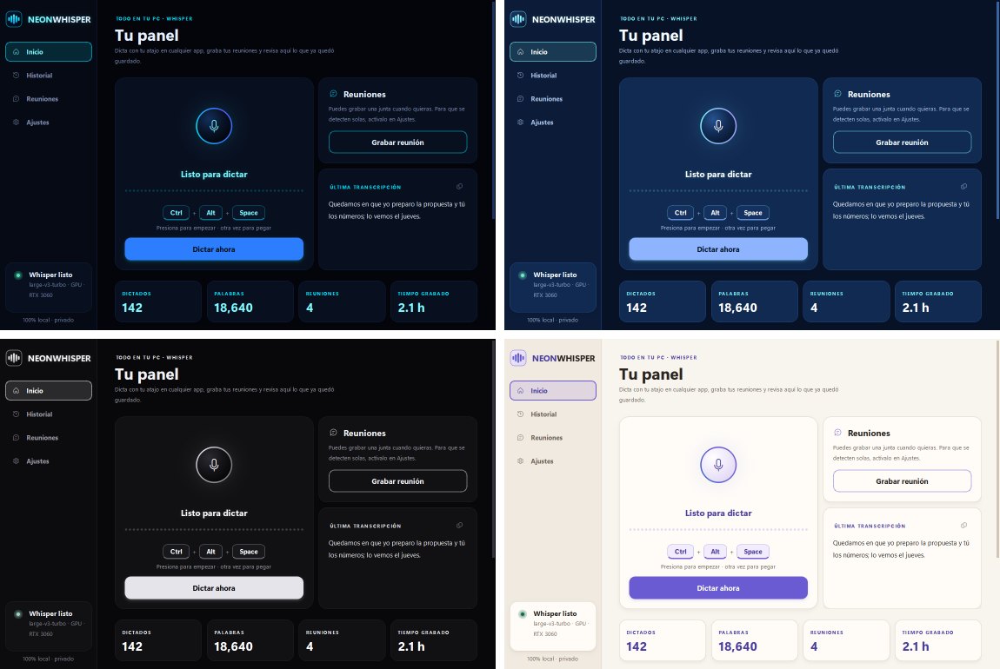
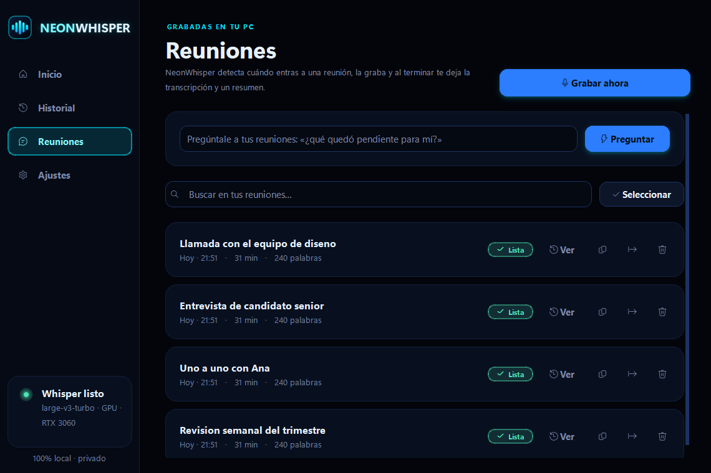

<p align="center">
  
</p>

<h1 align="center">NeonWhisper</h1>

<p align="center">
  <b>Dictado por voz 100% local con Whisper.</b><br>
  Presiona tu atajo en cualquier app, habla y el texto se pega solo donde está tu cursor.
</p>

<p align="center">
  
</p>

## Qué hace

- **Atajo global configurable** (por defecto `Ctrl + Alt + Space`): funciona en cualquier app, aunque NeonWhisper esté minimizado en la bandeja.
- **Dos modos**: *Iniciar / detener* (presionas una vez para hablar y otra para pegar) o *Mantener presionado* (walkie-talkie).
- **Pega automáticamente** donde está tu cursor y después restaura lo que tenías en el portapapeles.
- **Barra flotante neón** con las ondas de tu voz en tiempo real, cronómetro y botón para cancelar (`Esc` también cancela).
- **4 temas de interfaz** (Ajustes → Apariencia): *Neón* (negro con brillo azul), *Cristal* (vidrio azul, claro y luminoso), *Sutil* (negro con tonos blancos, sin color) y *Pastel* (crema con lavanda, menta y durazno, el único claro). Pintan toda la app —fondos, acentos, el orbe del micrófono y el ícono— y el cambio es inmediato, sin reiniciar.
- **Barra flotante a tu gusto** (Ajustes → Barra flotante): los mismos 4 diseños, tamaño, transparencia del fondo y opacidad, con vista previa en pantalla. Por defecto se pone a juego con el tema; puedes combinarlos como quieras.
- **Sonidos** al empezar y terminar de grabar, con volumen ajustable.
- **Historial** con búsqueda, copiar, borrar y exportar a `.txt`.
- **Limpiar reuniones a granel**: en la pestaña Reuniones, **Seleccionar** deja elegir varias con casillas (o *Todas*) y borrarlas de un golpe, junto con su audio. La que se está grabando no se puede borrar.
- **Whisper large-v3-turbo** con [faster-whisper](https://github.com/SYSTRAN/faster-whisper): en una GPU NVIDIA transcribe ~9 s de audio en ~0.4 s. Si no hay GPU, usa el CPU automáticamente.
- **Vocabulario personalizado** para que escriba bien nombres propios y términos técnicos.
- **Prueba de micrófono**: graba 4 segundos, mide el nivel y te reproduce lo que grabó.
- **Gestor de modelos**: descarga con barra de progreso, velocidad y tiempo restante; pausa, continúa (incluso después de cerrar la app) o cancela. Usa varias conexiones en paralelo y verifica cada archivo.
- **Graba tus reuniones solo** (Ajustes → Reuniones): detecta cuándo entras a una reunión de Teams, Zoom, Meet, Webex o Discord mirando qué app abrió el micrófono en Windows, graba tu micrófono **y lo que suena en tu PC** (WASAPI loopback: funciona con bocinas, audífonos USB o HDMI, sin instalar nada), y al terminar te deja la **transcripción completa** y un **resumen**. Todo en tu computadora.
- **Aviso flotante**: al detectar la reunión aparece un recuadro pequeño arriba a la izquierda con un botón **Grabar** (y el cronómetro con **Detener** mientras graba).
- **Transcripción en vivo y tus notas**: ve lo que se va diciendo mientras la reunión ocurre y apunta lo tuyo al lado; tus notas entran en el resumen final.
- **Plantillas de resumen**: acta, 1:1, entrevista, llamada de ventas o daily.
- **Pregúntale a tus reuniones**: «¿qué quedó pendiente para mí?» — responde el modelo local con lo que digan tus transcripciones, citando de qué reunión sale cada dato.
- **Se actualiza sola**: *Ajustes → Actualizaciones* compara tu versión con la publicada en este repositorio y la instala con un botón. Tus ajustes, tu historial y tus modelos no se tocan.
- **Programa de verdad**: se instala en Archivos de programa, corre como `NeonWhisper.exe` y aparece en *Aplicaciones instaladas* de Windows, con su botón de desinstalar.
- **Privado**: tu voz nunca sale de tu computadora.

<p align="center">
  
  
</p>

<p align="center">
  
</p>

<p align="center">
  
</p>

## Instalación (Windows 10/11)

1. Descarga el repositorio: botón verde **Code → Download ZIP** y descomprímelo donde sea (Descargas está bien: es solo el instalador).
2. Doble clic en **`Instalar.bat`** y acepta el aviso de administrador.

El instalador hace todo solo:

- copia NeonWhisper a **`C:\Program Files\NeonWhisper`**,
- instala [uv](https://github.com/astral-sh/uv) y Python 3.12 **dentro de esa carpeta** (no toca tu sistema),
- instala Whisper, las librerías CUDA y la interfaz, y genera **`NeonWhisper.exe`**,
- descarga el modelo `large-v3-turbo` (~1.6 GB, solo la primera vez),
- crea accesos directos en el escritorio y el menú Inicio, y activa el **inicio con Windows** (minimizado en la bandeja),
- lo **registra en Windows**: aparece en *Configuración → Aplicaciones → Aplicaciones instaladas*, con su ícono, su versión y su botón de desinstalar.

Si vienes de una versión anterior, el instalador **mueve tus modelos** a la carpeta nueva (no vuelves a descargar nada), borra los accesos directos viejos y te dice qué carpeta puedes eliminar. Tus ajustes y tu historial no se tocan.

¿No quieres pedir permisos de administrador? `Instalar.bat -PerUser` lo instala en `%LOCALAPPDATA%\Programs\NeonWhisper`: igual aparece en *Aplicaciones instaladas* y se desinstala igual.

> **Requisitos:** Windows 10/11 · ~5 GB libres · internet solo para instalar. Recomendado: GPU NVIDIA con drivers recientes (funciona sin GPU, pero más lento).

## Actualizar

**Desde la app**: *Ajustes → Actualizaciones → Buscar actualizaciones*. Compara tu versión con la publicada aquí y, si hay una más nueva, la instala con un botón. La app se cierra sola mientras se instala y vuelve a abrirse al terminar; te avisa antes de empezar.

**A mano**: doble clic en **`Actualizar.bat`**, en la carpeta del programa. Hace exactamente lo mismo desde una consola.

En los dos casos tus **ajustes**, tu **historial** y tus **modelos** quedan intactos.

Sin internet, baja el ZIP (botón verde **Code → Download ZIP**) y déjalo en Descargas: `Actualizar.bat` lo encuentra solo. También puedes pasarle la ruta:

```
Actualizar.bat -Zip "C:\Users\tu-usuario\Downloads\NeonWhisper-main.zip"
```

Si tu carpeta es un clon de git, actualízala con `git pull` y `uv sync`: la app lo detecta y te lo dice en vez de pisarte el repositorio.

## Desinstalar

*Configuración → Aplicaciones → Aplicaciones instaladas → NeonWhisper → Desinstalar* (o `Desinstalar.bat` en la carpeta del programa).

Quita el programa, sus accesos directos, el inicio con Windows y su registro. Antes de terminar te pregunta si quieres borrar también tus ajustes, tu historial y los modelos; si dices que no, se quedan por si reinstalas.

## Uso

| Acción | Cómo |
| --- | --- |
| Dictar | Pon el cursor donde quieras escribir → `Ctrl + Alt + Space` → habla → `Ctrl + Alt + Space` |
| Cancelar | `Esc` o la ✕ de la barra flotante |
| Cambiar atajo | Ajustes → Atajo de teclado → **Cambiar atajo** y presiona tu combinación |
| Ver historial | Pestaña **Historial** (buscar, copiar, borrar, exportar) |
| Borrar varias reuniones | Pestaña **Reuniones** → **Seleccionar** → marca las que quieras → **Borrar** |
| Grabar una reunión a mano | Pestaña **Reuniones** → **Grabar ahora**, o clic derecho en la bandeja |
| Salir | Clic derecho en el ícono de la bandeja → **Salir** |

Si dictas con la ventana de NeonWhisper enfocada (por ejemplo, haciendo clic en el micrófono), el texto se **copia** al portapapeles en lugar de pegarse.

<p align="center">
  
  
</p>

<p align="center">
  
</p>

## Reuniones

Actívalo en **Ajustes → Reuniones**. A partir de ahí NeonWhisper vigila si una app de reuniones está usando tu micrófono; cuando eso pasa, empieza a grabar y te avisa desde la bandeja.

| Paso | Qué hace |
| --- | --- |
| Detectar | Mira qué app tiene el micrófono (lo mismo que el icono de la barra de tareas) y si hay una ventana de videollamada. Tu propio dictado no cuenta. |
| Grabar | Tu micrófono **y** el audio del sistema, mezclados en un `.wav` de 16 kHz (~2 MB por minuto) que se escribe según llega. |
| Transcribir | Al terminar, con el mismo Whisper que dicta, de 5 en 5 minutos para que puedas seguir dictando mientras tanto. |
| Resumir | Un modelo de texto local (Llama 3.2, CTranslate2) escribe el resumen: resumen, temas, decisiones y tareas. |

Todo queda en la pestaña **Reuniones**: resumen, transcripción cruda, copiar y exportar a `.txt`. El `.wav` se borra al transcribir salvo que actives *Conservar el audio*.

**Tú eliges qué entra.** En la tarjeta de la reunión en curso hay dos botones, *Mi voz* y *Los demás*: los apagas y enciendes mientras grabas, y lo silenciado deja de guardarse sin desincronizar lo otro (útil para una llamada aparte o para no grabarte a ti). Los valores por defecto están en Ajustes → Reuniones, y ahí mismo el botón **Probar** graba cinco segundos y te dice cuánto entró por cada fuente, para no descubrir en la reunión que tu PC no expone el *loopback*.

El modelo del resumen se descarga desde **Ajustes → Reuniones** (Llama 3.2 3B, ~3.2 GB, o 1B, ~1.3 GB). Sin él, igual tienes la transcripción. Es un modelo pequeño: da un resumen decente y ordenado, no esperes nivel GPT-5.

**Avisa a los demás de que estás grabando.** En muchos sitios es obligatorio, y en general es lo correcto.

> Para grabar lo que dicen los demás hace falta un dispositivo *loopback* de WASAPI (Windows los expone como «Altavoces … [Loopback]»). Si tu equipo no lo tiene, NeonWhisper graba solo tu micrófono y te lo dice en la tarjeta de la reunión.

## Modelos

| Modelo | Precisión | Velocidad | VRAM aprox. |
| --- | --- | --- | --- |
| **large-v3-turbo** (predeterminado) | Muy alta | Muy rápida | ~2 GB |
| large-v3 | Máxima | Varias veces más lento que turbo | ~4 GB |
| medium | Alta | Rápida | ~2 GB |
| small | Media | Rápida incluso en CPU | ~1 GB |

Y para resumir reuniones:

| Modelo | Tamaño | Notas |
| --- | --- | --- |
| **llama-3.2-3b** (predeterminado) | ~3.2 GB | Mejor español, resúmenes más finos |
| llama-3.2-1b | ~1.3 GB | Más rápido y ligero; los resúmenes se notan más flojos |

Se administran en **Ajustes → Modelos de Whisper** (Descargar, Pausar, Continuar, Usar, Eliminar) y se guardan en `%LOCALAPPDATA%\NeonWhisper\models`.

## Dónde se guardan tus datos

- El programa: `C:\Program Files\NeonWhisper` (o `%LOCALAPPDATA%\Programs\NeonWhisper` con `-PerUser`)
- Ajustes, historial (`history.db`) y log: `%APPDATA%\NeonWhisper`
- Modelos de Whisper y de resumen: `%LOCALAPPDATA%\NeonWhisper\models`
- Audio de las reuniones mientras se procesan: `%LOCALAPPDATA%\NeonWhisper\meetings`

Nada de esto vive dentro de la carpeta del programa, así que actualizar o reinstalar no se lleva tus cosas por delante. Si junto al programa existe una carpeta `models` (instalaciones portables o anteriores a la v1.3), se sigue usando esa.

## Solución de problemas

- **El atajo no hace nada en una app concreta:** si esa app corre como administrador, Windows bloquea atajos globales de apps normales. Para dictar ahí, abre NeonWhisper también como administrador.
- **Dice «Whisper listo · CPU» teniendo GPU NVIDIA:** actualiza tus drivers de NVIDIA y reinicia la app. En Ajustes → Procesador puedes forzar «GPU NVIDIA (CUDA)» para ver el error exacto.
- **No se escucha/graba nada:** elige tu micrófono en Ajustes → Audio.
- **Registro de errores:** `%APPDATA%\NeonWhisper\neonwhisper.log`.

## Stack

Python 3.12 · [faster-whisper](https://github.com/SYSTRAN/faster-whisper) (CTranslate2 + CUDA 12) · PySide6 (Qt) · sounddevice · keyboard · SQLite

## Licencia

MIT
